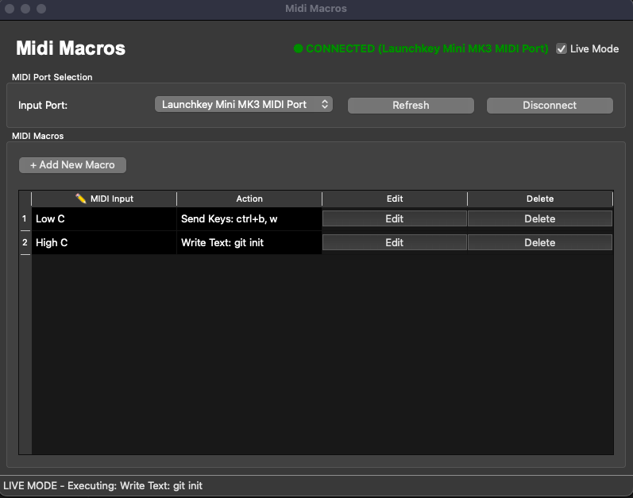

# MIDI Macros

This is a simple application to allow triggering arbitrary actions based on MIDI key presses.

I found a couple of apps that do something similar, but they all seemed to be paid so I thought I would create one for my own use.

This is also an experiment with AI coding, as this app was completely written by Claude Code.

## Screenshot



## Features

- **Send Keys**: Execute keyboard shortcuts (Ctrl+C, Alt+Tab, etc.)
- **Write Text**: Type text strings automatically
- **Test/Live Mode**: Safe testing before executing real actions
- **Persistent Storage**: Macros are saved and restored between sessions
- **MIDI Port Management**: Easy connection to MIDI devices

## Running

### Option 1: Single File Executable (Recommended)

Requires [uv](https://docs.astral.sh/uv/) installed.

Make the file executable and run directly:

```shell
chmod +x main.py
./main.py
```

Or run with uv explicitly:

```shell
uv run main.py
```

### Option 2: Traditional Setup

First set up a virtual environment and install dependencies:

```shell
python -m venv .venv
source .venv/bin/activate  # On Windows: .venv\Scripts\activate
uv install
```

Then run:

```shell
python main.py
```

## Usage

1. **Connect MIDI Device**: Select your MIDI input port and click "Connect"
2. **Create Macros**: Click "+ Add New Macro", press a MIDI key, then configure the action
3. **Test Mode**: Toggle "Live Mode" checkbox to switch between safe testing and actual execution
4. **Edit Macros**: Use the "Edit" button to modify existing macro actions
5. **Rename Triggers**: Double-click the MIDI Input name (✏️ column) to rename

## Debug Mode

For troubleshooting MIDI issues, run with debug logging:

```shell
DEBUG=true ./main.py
```

This creates a debug log file at `~/.midi_macros_debug.log` showing all MIDI messages and execution details.

## Configuration

Macros are automatically saved to `~/.midi_macros_config.json` and restored when the app starts.